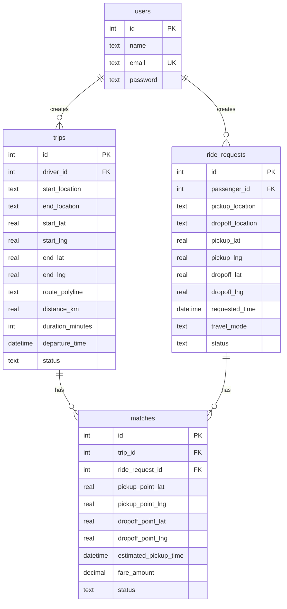
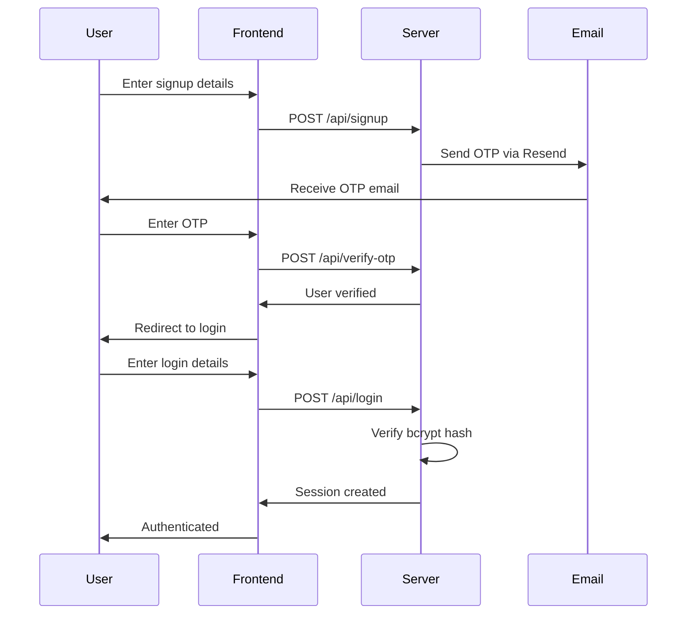

# RideMate - Context Documentation

> **Last Updated:** January 28, 2026  
> **Purpose:** This document provides a comprehensive overview of the RideMate codebase, its architecture, and tracks all changes made during development.

---

## 📋 Table of Contents

1. [Project Overview](#project-overview)
2. [Technology Stack](#technology-stack)
3. [Project Structure](#project-structure)
4. [Database Schema](#database-schema)
5. [API Endpoints](#api-endpoints)
6. [Frontend Pages](#frontend-pages)
7. [Real-Time Features](#real-time-features)
8. [Authentication System](#authentication-system)
9. [Changelog](#changelog)

---

## 🚗 Project Overview

**RideMate** is a ride-sharing web application that connects drivers with passengers for carpooling. The application allows:

- **Drivers** to offer rides by specifying their route
- **Passengers** to search for available drivers along their desired route
- **Smart route matching** using provider-agnostic encoded polyline data (Ola Maps)
- **Real-time notifications** when passengers request rides from drivers
- **Privacy-preserving** route segments (passengers only see relevant portions of driver routes)

### Key Features

| Feature | Description |
|---------|-------------|
| **Route Matching** | Uses Haversine formula to match passenger pickup/dropoff with driver routes |
| **Partial Rides** | Supports partial rides where passenger can be dropped at closest point on driver's route |
| **Real-Time Notifications** | WebSocket-based instant notifications for drivers |
| **Email Verification** | OTP-based email verification using Resend API |
| **Fare Calculation** | Dynamic fare based on distance (₹5/km base rate with 14% platform fee) |

---

## 🛠 Technology Stack

### Backend
| Technology | Version | Purpose |
|------------|---------|---------|
| **Node.js** | - | Runtime environment |
| **Express.js** | 5.1.0 | Web framework |
| **SQLite3** | 5.1.7 | Database |
| **Socket.io** | 4.8.1 | Real-time WebSocket communication |
| **bcrypt** | 6.0.0 | Password hashing |
| **express-session** | 1.18.1 | Session management |
| **Resend** | 4.6.0 | Email service (OTP) |
| **nodemailer** | 7.0.5 | Email transport (alternative) |

### Frontend
| Technology | Purpose |
|------------|---------|
| **HTML5** | Page structure |
| **Vanilla CSS** | Styling (no frameworks) |
| **Vanilla JavaScript** | Client-side logic |
| **Socket.io Client** | 4.8.1 | Real-time communication |
| **Ola Maps API** | Maps, autocomplete, geocoding, and route visualization |

---

## 📁 Project Structure

```
RideMate-main/
├── 📄 server.js                    # Main Express server (1139 lines)
├── 📄 database.db                  # SQLite database file
├── 📄 database-schema.sql          # SQL schema reference
├── 📄 package.json                 # Dependencies & scripts
│
├── 🌐 FRONTEND PAGES
│   ├── index.html                  # Main landing page with search form
│   ├── login.html                  # User login page
│   ├── signup.html                 # User registration with OTP
│   ├── driver-confirmation.html    # Driver trip confirmation & management
│   └── passenger-confirmation.html # Passenger driver selection & booking
│
├── 🎨 STYLES
│   ├── style.css                   # Main stylesheet (39KB)
│   ├── auth.css                    # Authentication pages styles
│   └── pwa-mobile.css              # PWA mobile optimizations ✨ NEW
│
├── 📜 SCRIPTS
│   ├── auth.js                     # Login/Signup form handlers
│   ├── global-notifications.js     # WebSocket notification manager
│   └── service-worker.js           # PWA offline caching ✨ NEW
│
├── 📱 PWA ASSETS ✨ NEW
│   ├── manifest.json               # PWA manifest file
│   └── icons/                      # App icons (72px to 512px)
│
├── 📄 context.md                   # This documentation file
└── 📁 node_modules/                # Dependencies
```

---

## 🗄 Database Schema

### Tables Overview



### Table Details

#### `users`
| Column | Type | Constraints |
|--------|------|-------------|
| id | INTEGER | PRIMARY KEY AUTOINCREMENT |
| name | TEXT | NOT NULL |
| email | TEXT | NOT NULL, UNIQUE |
| password | TEXT | NOT NULL (bcrypt hashed) |

#### `trips` (Driver Offerings)
| Column | Type | Description |
|--------|------|-------------|
| id | INTEGER | Primary key |
| driver_id | INTEGER | FK to users |
| start_location | TEXT | Starting address |
| end_location | TEXT | Destination address |
| start_lat, start_lng | REAL | Start coordinates |
| end_lat, end_lng | REAL | End coordinates |
| route_polyline | TEXT | Encoded route polyline (Ola-compatible) |
| distance_km | REAL | Total trip distance |
| duration_minutes | INTEGER | Estimated duration |
| departure_time | DATETIME | Scheduled departure |
| status | TEXT | 'active', 'completed', 'cancelled' |

#### `ride_requests` (Passenger Requests)
| Column | Type | Description |
|--------|------|-------------|
| id | INTEGER | Primary key |
| passenger_id | INTEGER | FK to users |
| pickup_location | TEXT | Pickup address |
| dropoff_location | TEXT | Dropoff address |
| pickup_lat, pickup_lng | REAL | Pickup coordinates |
| dropoff_lat, dropoff_lng | REAL | Dropoff coordinates |
| travel_mode | TEXT | 'bus', 'car', 'train' |
| status | TEXT | 'searching', 'matched', 'completed', 'cancelled' |

#### `matches` (Driver-Passenger Connections)
| Column | Type | Description |
|--------|------|-------------|
| id | INTEGER | Primary key |
| trip_id | INTEGER | FK to trips |
| ride_request_id | INTEGER | FK to ride_requests |
| pickup_point_lat/lng | REAL | Actual pickup point on route |
| dropoff_point_lat/lng | REAL | Actual dropoff point on route |
| fare_amount | DECIMAL | Calculated fare |
| status | TEXT | 'pending', 'accepted', 'rejected', 'completed' |

---

## 🔌 API Endpoints

### Authentication

| Method | Endpoint | Description |
|--------|----------|-------------|
| POST | `/api/signup` | Register new user (sends OTP) |
| POST | `/api/verify-otp` | Verify email OTP |
| POST | `/api/login` | User login |
| POST | `/api/logout` | User logout |
| GET | `/api/auth/status` | Check authentication status |

### Driver Endpoints

| Method | Endpoint | Description |
|--------|----------|-------------|
| POST | `/api/trips` | Create a new trip |
| GET | `/api/trips/active` | Get driver's active trip |
| GET | `/api/trips/:id` | Get specific trip details |
| GET | `/api/trips/:id/route-segment` | Get privacy-safe route segment |
| GET | `/api/trips/:id/requests` | Get passenger requests for trip |
| PUT | `/api/trips/:id/cancel` | Cancel a trip |

### Passenger Endpoints

| Method | Endpoint | Description |
|--------|----------|-------------|
| POST | `/api/ride-requests` | Create ride request |
| GET | `/api/available-drivers` | Search for matching drivers |

### Matching Endpoints

| Method | Endpoint | Description |
|--------|----------|-------------|
| POST | `/api/matches` | Create driver-passenger match |
| PUT | `/api/matches/:id/status` | Accept/reject match |

---

## 🌐 Frontend Pages

### 1. `index.html` - Main Landing Page
- Hero section with search form
- Pickup/Dropoff location inputs with Ola-backed autocomplete
- DateTime picker for scheduling
- "Heading to" (Driver) and "Be Passenger" action buttons
- User menu dropdown when logged in
- Navigation links (Ride, Drive, Business, About)

### 2. `login.html` - Login Page
- Email and password inputs
- Form validation
- Redirect to index.html on success
- Toast notifications for success/error

### 3. `signup.html` - Registration Page
- Name, email, password inputs
- OTP verification section (hidden initially)
- Email verification via Resend API
- Redirect to login.html after verification

### 4. `driver-confirmation.html` - Driver Dashboard
- Shows active trip details
- Displays route on Google Map
- Lists incoming passenger requests
- Accept/Decline request buttons
- Privacy notice about route sharing
- Real-time notification popup for new requests

### 5. `passenger-confirmation.html` - Driver Selection
- Lists available drivers matching route
- Shows driver info, rating, vehicle details
- Displays fare and ETA estimates
- Route preview on map
- Partial ride indicators
- Select driver functionality

---

## ⚡ Real-Time Features

### WebSocket Events (Socket.io)

```javascript
// Server-side events
io.on('connection', (socket) => {
    // Driver joins their trip room
    socket.on('driver-join-trip', (data) => { ... });
    
    // Passenger notifies driver of selection
    socket.on('passenger-selected-driver', (data) => { ... });
    
    // Handle disconnections
    socket.on('disconnect', () => { ... });
});
```

### GlobalNotificationManager Class

Located in `global-notifications.js`, this class handles:

| Method | Purpose |
|--------|---------|
| `init()` | Initialize notification system |
| `checkDriverStatus()` | Check if user has active trip |
| `initializeWebSocket()` | Setup Socket.io connection |
| `joinTripRoom()` | Join room as driver |
| `handleInstantNotification()` | Process incoming notifications |
| `showInstantPopup()` | Display notification popup |
| `acceptRequest()` | Accept passenger request |
| `declineRequest()` | Decline passenger request |
| `playNotificationSound()` | Audio notification |
| `showToast()` | Display toast messages |

---

## 🔐 Authentication System

### Flow



### Session Configuration

```javascript
app.use(session({
    secret: 'your-secret-key',
    resave: false,
    saveUninitialized: false,
    cookie: {
        secure: false,
        maxAge: 24 * 60 * 60 * 1000 // 24 hours
    }
}));
```

---

## 🧮 Core Algorithms

### Route Matching

The application uses sophisticated algorithms for matching:

1. **Haversine Distance Calculation**
   - Calculates distance between two GPS coordinates
   - Used to find closest points on driver's route

2. **Polyline Decoding**
    - Decodes encoded route polyline (Ola-compatible)
   - Converts to array of lat/lng points

3. **Route Matching Threshold**
   - Dynamic threshold based on trip distance
   - Short trips (< 10km): 400m threshold
   - Medium trips (10-20km): 850m threshold
   - Long trips (> 50km): up to 3650m threshold

4. **Partial Ride Detection**
   - If passenger destination is not on route
   - Finds closest point for drop-off
   - Calculates remaining distance to destination

### Fare Calculation

```javascript
// Base rate: ₹5 per km (driver rate)
// Platform fee: 14%
// Minimum fare: ₹20

const baseRate = 5; // per km
const platformFee = 0.14;
const fareBeforeFee = distance_km * baseRate;
const totalFare = fareBeforeFee / (1 - platformFee);
const driverEarnings = totalFare * 0.86;
```

---

## 📝 Changelog

### Version 1.2.0 (UI/UX Improvements - February 1, 2026)

> **Focus:** Mobile responsiveness, scrolling fixes, location autocomplete, and professional polish

| Type | Description |
|------|-------------|
| 🐛 | **Fixed Scrolling Issues** - Removed CSS rules blocking page scroll (`-webkit-touch-callout: none`, `overscroll-behavior`) |
| 🐛 | **Fixed Z-Index Layering** - Suggestions dropdown now appears above other input fields using `:focus-within` |
| 🐛 | **Disabled Browser Autocomplete** - Added `autocomplete="off"`, `autocorrect="off"`, `spellcheck="false"` to prevent browser suggestions |
| ✨ | **Local Ahmedabad Autocomplete** - Added 80+ Ahmedabad locations (areas, malls, colleges, hospitals, landmarks) |
| 🔧 | **Migrated map provider** - Removed legacy provider hooks and standardized on Ola Maps |
| 🐛 | **Fixed Mobile Profile Dropdown** - Dropdown now appears under profile button (not bottom sheet) with smooth animation |
| 🎨 | **Improved Dropdown Styling** - Professional design with z-index: 100000, fade/scale animation, red logout button |
| 🐛 | **Fixed Active Trip Prompt** - Added `pointer-events: none` when hidden, repositioned above mobile nav |
| 🔧 | **Fixed Datetime Picker** - Increased z-index to 99999 for proper visibility |

#### Files Modified

| File | Changes |
|------|---------|
| `pwa-mobile.css` | Added `!important` scroll rules, removed touch-callout blocking |
| `mobile-responsive.css` | Fixed mobile dropdown positioning and animation |
| `style.css` | Added `:focus-within` z-index management, suggestions list styling |
| `index.html` | Added autocomplete blocking attributes, fixed active-trip-prompt, and standardized map provider flow |
| `location-autocomplete.js` | Complete rewrite with 80+ Ahmedabad locations, smart matching, professional styling |

#### Local Autocomplete Locations Include

```
📍 Major Areas: Satellite, Vastrapur, Prahladnagar, CG Road, SG Highway, Bopal, Thaltej, Bodakdev...
📍 Transport: Ahmedabad Airport, Kalupur Railway Station, GSRTC Bus Stand, Metro Stations...
📍 Education: IIM Ahmedabad, NID, CEPT, Gujarat University, Nirma University, DAIICT...
📍 Malls: Ahmedabad One, Alpha One, Iscon Mega Mall, Himalaya Mall...
📍 Hospitals: Civil Hospital, Zydus, Sterling, CIMS, Apollo...
📍 Landmarks: Science City, Sabarmati Ashram, Riverfront, GIFT City, Akshardham...
```

---

### Version 1.1.0 (PWA Conversion - January 28, 2026)

| Type | Description |
|------|-------------|
| ✨ | **Converted to Progressive Web App (PWA)** - App can now be installed on Android devices |
| 📄 | Added `manifest.json` - PWA metadata with app name, icons, colors, display settings |
| 📄 | Added `service-worker.js` - Offline caching for all static assets and API responses |
| 📄 | Added `pwa-mobile.css` - Mobile-optimized styles with touch improvements |
| 📁 | Added `/icons` folder - App icons in multiple sizes (72x72 to 512x512) |
| 🔧 | Updated all HTML files with PWA meta tags and service worker registration |
| 📱 | Added mobile viewport settings (`maximum-scale=1.0, user-scalable=no`) |
| 🎨 | Added theme-color meta tag for browser chrome customization |
| 🔔 | Added PWA install prompt handling in JavaScript |

#### New File Structure
```
RideMate-main/
├── manifest.json          # NEW - PWA manifest
├── service-worker.js      # NEW - Offline caching
├── pwa-mobile.css         # NEW - Mobile styles
└── icons/                 # NEW - App icons
    ├── icon-72x72.png
    ├── icon-96x96.png
    ├── icon-128x128.png
    ├── icon-144x144.png
    ├── icon-152x152.png
    ├── icon-192x192.png
    ├── icon-384x384.png
    └── icon-512x512.png
```

### Version 1.0.0 (Initial Review - January 28, 2026)

| Type | Description |
|------|-------------|
| 📖 | Initial documentation created |
| 🔍 | Complete codebase review performed |

---

## 🔧 Development Notes

### Running the Application

```bash
# Install dependencies
npm install

# Start the server
node server.js

# Server runs on http://localhost:3000
```

### Environment Configuration

> **⚠️ Security Note:** The Resend API key is currently hardcoded in `server.js`. This should be moved to environment variables for production.

```javascript
// Current (insecure)
const resend = new Resend('re_YKiaFw7e_LXUhzgyNhgdUGBsCbaPkqsW1');

// Recommended
const resend = new Resend(process.env.RESEND_API_KEY);
```

### Ola Maps API

The application uses Ola Maps APIs for:
- Autocomplete suggestions
- Geocoding and reverse geocoding
- Route calculation (with distance matrix fallback)
- Map display

> **Note:** Configure `OLA_MAPS_API_KEY` in environment variables.

---

## 📊 File Size Summary

| File | Lines | Size |
|------|-------|------|
| server.js | 1,139 | 45.7 KB |
| index.html | 1,257 | 53.6 KB |
| driver-confirmation.html | 1,613 | 66.7 KB |
| passenger-confirmation.html | 2,021 | 81.9 KB |
| style.css | - | 39.4 KB |
| global-notifications.js | 532 | 21.1 KB |
| auth.js | 123 | 4.2 KB |
| database-schema.sql | 69 | 3.0 KB |

---

*This document will be updated with each significant change to the codebase.*
